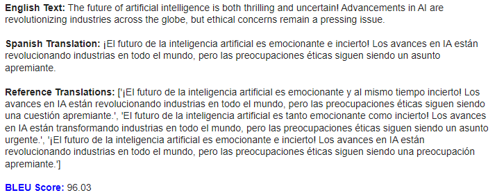

# <h1 align="center">**Translation**</h1>

 

In this repository, translation models are implemented, a task of Natural Language Processing (NLP) that involves converting a sequence of text or audio from one language to another, with text translation being the most common. These models are created using TensorFlow and Hugging Face's Transformers libraries.

The most significant use cases include document translation, web content localization, real-time interpretation in video conferencing applications, and linguistic assistance in messaging and social media applications. Additionally, these models are fundamental in the creation of multilingual virtual assistants and in the automation of translation processes in global companies.

## **Implemented Models:**

- **English to Spanish text translation with LSTM networks:** Model using [LSTM networks](https://www.tensorflow.org/api_docs/python/tf/keras/layers/LSTM) with an [Attention mechanism](https://www.tensorflow.org/api_docs/python/tf/keras/layers/MultiHeadAttention) to translate text from English to Spanish, trained with the [ManyThings dataset](https://www.manythings.org/anki/). It has high performance and [BLEU score](https://huggingface.co/spaces/evaluate-metric/bleu) for short texts, medium for medium-length texts, and low for long texts.

- **English to Spanish text translation with MarianMT:** Model [``Helsinki-NLP/opus-mt-en-es``](https://huggingface.co/Helsinki-NLP/opus-mt-en-es), which is a variant of [MarianMT](https://huggingface.co/docs/transformers/model_doc/marian) fine-tuned with the [OPUS eng-spa dataset](https://github.com/Helsinki-NLP/Tatoeba-Challenge/blob/master/models/eng-spa/README.md). To further enhance its performance in English to Spanish text translation, it is fine-tuned again with the ManyThings dataset. It has excellent performance and a high BLEU score for texts of any length, from short to very long.

## **Some Results**

 

---

 

---

 

---

 

---

 

---

 

#### *More results can be found in the respective notebooks.*

## **Technological Stack**
 

## **Contact**

